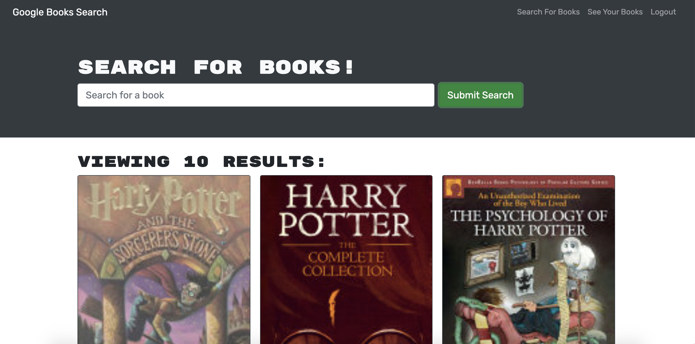

# book-search-engine

## This application uses the Google Books API search engine to allow user to search for books to read.  The starter code used a RESTful API which was updated to use GraphQL API with Apollo Server.  Using the MERN stack, the application is built with a React front end, MongoDB database, and Node.js/Express.js server and API.

## Heroku: https://fathomless-temple-29688.herokuapp.com/
## GitHub Repository: https://github.com/ndahlberg95/book-search-engine